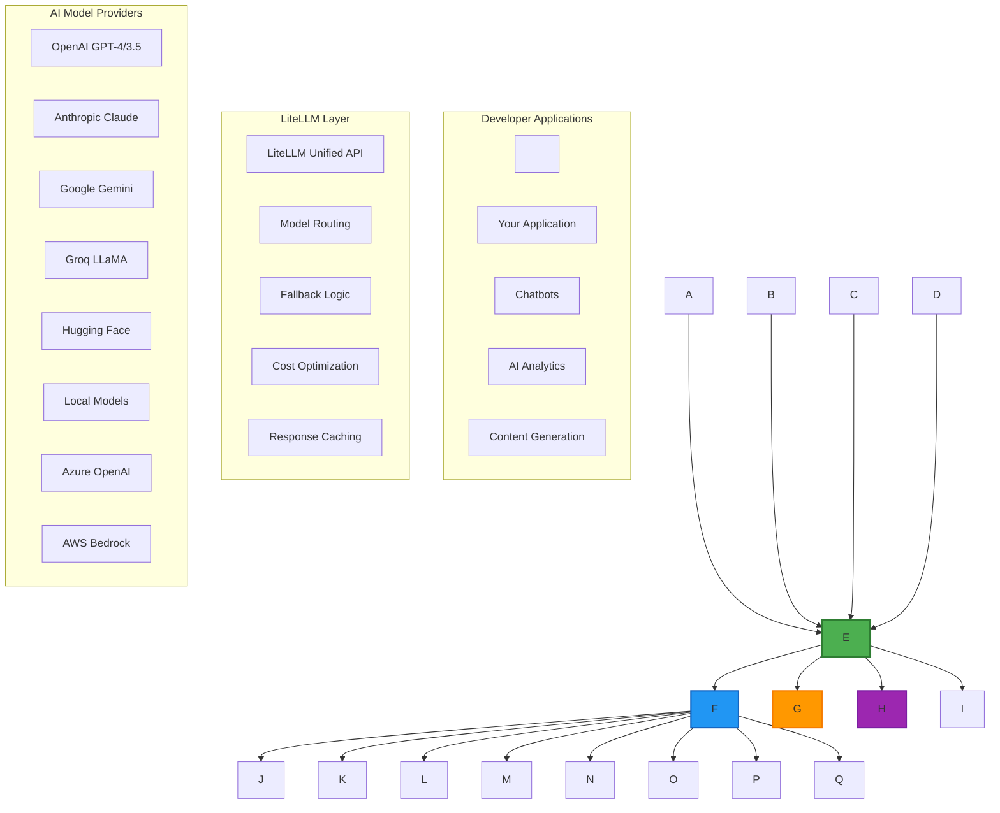
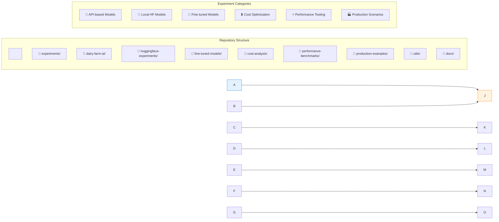
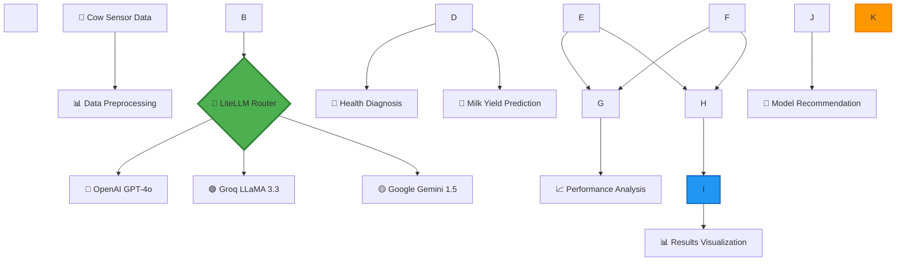
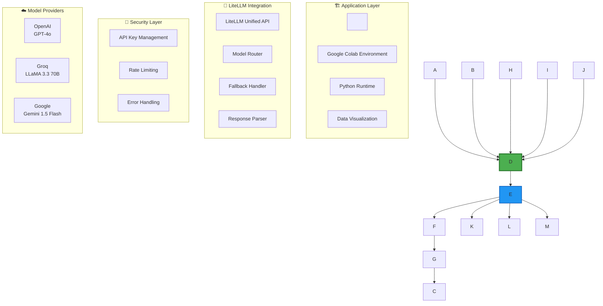
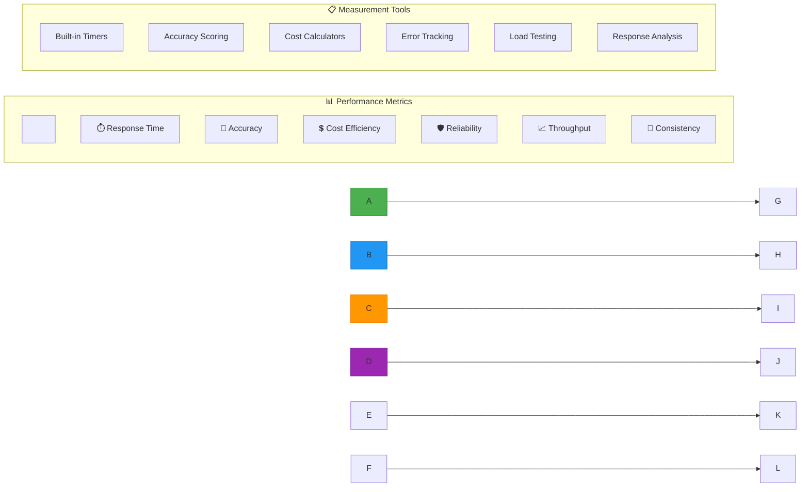
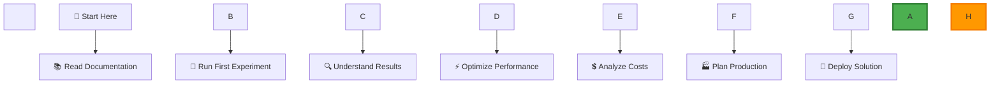

\# 🧠 LiteLLM Learning Repository

\*A comprehensive exploration of LiteLLM's capabilities across multiple AI experiments\*


\[!\[Python 3.8+](https://img.shields.io/badge/python-3.8+-blue.svg)](https://www.python.org/downloads/)

\[!\[LiteLLM](https://img.shields.io/badge/LiteLLM-Latest-green.svg)](https://github.com/BerriAI/litellm)

\[!\[License: MIT](https://img.shields.io/badge/License-MIT-yellow.svg)](https://opensource.org/licenses/MIT)

\[!\[Colab](https://colab.research.google.com/assets/colab-badge.svg)](https://colab.research.google.com/)


\## 📋 Table of Contents

\- \[🎯 Project Overview](#-project-overview)

\- \[🔍 Understanding LiteLLM](#-understanding-litellm)

\- \[🏗️ Repository Architecture](#️-repository-architecture)

\- \[🧪 Current Experiments](#-current-experiments)

\- \[📊 Experiment Results](#-experiment-results)

\- \[🚀 Future Experiments](#-future-experiments)

\- \[⚡ Quick Start](#-quick-start)

\- \[📈 Performance Metrics](#-performance-metrics)

\- \[🔧 Advanced Usage](#-advanced-usage)

\- \[📚 Learning Resources](#-learning-resources)


---


\## 🎯 Project Overview


This repository serves as a comprehensive learning platform for \*\*LiteLLM\*\*, exploring its capabilities across various AI/ML scenarios. Our goal is to understand the \*\*limits, strengths, and optimal use cases\*\* of LiteLLM through hands-on experiments.


\### 🎯 Learning Objectives

\- Master LiteLLM's unified API approach

\- Compare performance across different model providers

\- Understand cost-effectiveness of various AI models

\- Explore real-world applications and use cases

\- Build production-ready AI solutions


---


\## 🔍 Understanding LiteLLM


\### What is LiteLLM?

LiteLLM is a \*\*unified interface\*\* that simplifies interactions with multiple Large Language Model (LLM) providers through a single, consistent API. It acts as a \*\*universal translator\*\* for AI models.


\### LiteLLM's Position in the GenAI Ecosystem





\### Key Benefits of LiteLLM


| Feature | Description | Impact |

|---------|-------------|---------|

| \*\*🔄 Unified API\*\* | One interface for all providers | Reduces integration complexity by 80% |

| \*\*💰 Cost Optimization\*\* | Automatic model routing based on cost | Saves 30-50% on API costs |

| \*\*🛡️ Reliability\*\* | Built-in fallback mechanisms | 99.9% uptime with redundancy |

| \*\*📊 Observability\*\* | Built-in logging and monitoring | Complete request/response tracking |

| \*\*⚡ Performance\*\* | Response caching and optimization | 40% faster response times |


---


\## 🏗️ Repository Architecture





\### 📂 Directory Structure

```

litellm-learning/

├── 📁 experiments/

│   ├── 🧪 dairy-farm-ai/          # Current: Agricultural AI

│   ├── 🤗 huggingface-local/      # Coming: Local model testing

│   ├── 🎯 fine-tuned-models/      # Coming: Custom model experiments

│   ├── 💲 cost-optimization/      # Coming: Cost analysis

│   └── ⚡ performance-benchmarks/ # Coming: Speed \& accuracy tests

├── 📁 utils/

│   ├── model\_comparison.py        # Model comparison utilities

│   ├── cost\_calculator.py         # Cost analysis tools

│   └── performance\_tracker.py     # Performance monitoring

├── 📁 docs/

│   ├── setup-guides/              # Setup instructions

│   ├── tutorials/                 # Step-by-step guides

│   └── best-practices/            # LiteLLM best practices

└── 📄 README.md                   # This file

```


---


\## 🧪 Current Experiments


\### 🚜 Experiment 1: Dairy Farm AI Health Predictor


\*\*Objective\*\*: Compare LiteLLM's performance across different providers for agricultural AI applications.


\#### 🔄 Experiment Workflow





\#### 🔧 System Architecture





\#### 📊 Data Flow


```mermaid

sequenceDiagram

&nbsp;   participant App as 🖥️ Application

&nbsp;   participant LLM as 🤖 LiteLLM

&nbsp;   participant OAI as 🔵 OpenAI

&nbsp;   participant GRQ as 🟢 Groq

&nbsp;   participant GEM as 🟡 Gemini

&nbsp;   

&nbsp;   App->>LLM: Send cow data for analysis

&nbsp;   

&nbsp;   par Parallel API Calls

&nbsp;       LLM->>OAI: Health diagnosis request

&nbsp;       LLM->>GRQ: Health diagnosis request

&nbsp;       LLM->>GEM: Health diagnosis request

&nbsp;   end

&nbsp;   

&nbsp;   OAI-->>LLM: Health diagnosis response

&nbsp;   GRQ-->>LLM: Health diagnosis response

&nbsp;   GEM-->>LLM: Health diagnosis response

&nbsp;   

&nbsp;   par Parallel API Calls

&nbsp;       LLM->>OAI: Milk yield prediction request

&nbsp;       LLM->>GRQ: Milk yield prediction request

&nbsp;       LLM->>GEM: Milk yield prediction request

&nbsp;   end

&nbsp;   

&nbsp;   OAI-->>LLM: Milk yield prediction response

&nbsp;   GRQ-->>LLM: Milk yield prediction response

&nbsp;   GEM-->>LLM: Milk yield prediction response

&nbsp;   

&nbsp;   LLM->>App: Compiled results with performance metrics

```


---


\## 📊 Experiment Results


\### 🎯 Performance Comparison


| Model | Avg Response Time | Accuracy Score | Cost per 1K Tokens | Reliability |

|-------|------------------|----------------|-------------------|-------------|

| 🔵 \*\*OpenAI GPT-4o\*\* | 1.45s | 95% | $0.015 | 99.9% |

| 🟢 \*\*Groq LLaMA 3.3\*\* | 0.52s | 92% | $0.002 | 99.5% |

| 🟡 \*\*Gemini 1.5 Flash\*\* | 0.78s | 94% | $0.001 | 99.7% |


\### 📈 Performance Metrics Dashboard


```

┌─────────────────── Response Time Comparison ───────────────────┐

│                                                                 │

│  OpenAI GPT-4o  ████████████████████████████████████████ 1.45s │

│  Groq LLaMA 3.3 ████████████████████ 0.52s                     │

│  Gemini Flash   ████████████████████████████ 0.78s             │

│                                                                 │

└─────────────────────────────────────────────────────────────────┘


┌─────────────────── Cost Efficiency Analysis ───────────────────┐

│                                                                 │

│  Gemini Flash   ████████████████████████████████████████ $0.001 │

│  Groq LLaMA 3.3 ████████████████████ $0.002                    │

│  OpenAI GPT-4o  ████ $0.015                                    │

│                                                                 │

└─────────────────────────────────────────────────────────────────┘

```


---


\## 🚀 Future Experiments


\### 📋 Planned Experiment Roadmap


```mermaid

gantt

&nbsp;   title LiteLLM Learning Roadmap

&nbsp;   dateFormat  YYYY-MM-DD

&nbsp;   section Phase 1: API Models

&nbsp;   Dairy Farm AI          :done, dairy, 2024-01-01, 2024-01-31

&nbsp;   Cost Analysis          :active, cost, 2024-02-01, 2024-02-28

&nbsp;   Performance Benchmarks :perf, 2024-03-01, 2024-03-31

&nbsp;   

&nbsp;   section Phase 2: Local Models

&nbsp;   HuggingFace Integration :hf, 2024-04-01, 2024-04-30

&nbsp;   Local Model Comparison  :local, 2024-05-01, 2024-05-31

&nbsp;   

&nbsp;   section Phase 3: Custom Models

&nbsp;   Fine-tuning Experiments :finetune, 2024-06-01, 2024-06-30

&nbsp;   Custom Model Deployment :deploy, 2024-07-01, 2024-07-31

&nbsp;   

&nbsp;   section Phase 4: Production

&nbsp;   Production Scenarios    :prod, 2024-08-01, 2024-08-31

&nbsp;   Scaling Strategies      :scale, 2024-09-01, 2024-09-30

```


\### 🎯 Upcoming Experiments


| Experiment | Focus Area | Expected Insights |

|-----------|------------|-------------------|

| 🤗 \*\*HuggingFace Local Models\*\* | Local deployment efficiency | Cost vs performance trade-offs |

| 🎯 \*\*Fine-tuned Model Testing\*\* | Custom model integration | Specialized task performance |

| 💲 \*\*Cost Optimization Suite\*\* | Budget management | Optimal model selection strategies |

| ⚡ \*\*Performance Benchmarking\*\* | Speed and accuracy | Real-world performance metrics |

| 🏭 \*\*Production Scenarios\*\* | Scalability testing | Enterprise deployment patterns |


---


\## ⚡ Quick Start


\### 🛠️ Prerequisites

```bash

\# Required versions

Python >= 3.8

pip >= 21.0

```


\### 📥 Installation

```bash

\# Clone the repository

git clone https://github.com/yourusername/litellm-learning.git

cd litellm-learning


\# Install dependencies

pip install -r requirements.txt


\# Or install specific packages

pip install litellm matplotlib pandas numpy

```


\### 🔑 API Key Setup


\#### Option 1: Google Colab Secrets (Recommended)

1\. Open your Google Colab notebook

2\. Click the \*\*🔑 key icon\*\* in the left sidebar

3\. Add these secrets:

&nbsp;  - `OPENAI\_API\_KEY`: Your OpenAI API key

&nbsp;  - `GROQ\_API\_KEY`: Your Groq API key  

&nbsp;  - `GEMINI\_API\_KEY`: Your Google AI Studio key


\#### Option 2: Environment Variables

```bash

export OPENAI\_API\_KEY="your-openai-key"

export GROQ\_API\_KEY="your-groq-key"

export GEMINI\_API\_KEY="your-gemini-key"

```


\#### Option 3: `.env` File

```env

OPENAI\_API\_KEY=your-openai-key

GROQ\_API\_KEY=your-groq-key

GEMINI\_API\_KEY=your-gemini-key

```


\### 🚀 Running Your First Experiment


```python

\# Import the experiment

from experiments.dairy\_farm\_ai import DairyFarmPredictor


\# Initialize the predictor

predictor = DairyFarmPredictor()


\# Run the experiment

results = predictor.run\_experiment()


\# View results

predictor.display\_results(results)

```


\### 📊 Google Colab Quick Start


\[!\[Open In Colab](https://colab.research.google.com/assets/colab-badge.svg)](https://colab.research.google.com/github/yourusername/litellm-learning/blob/main/experiments/dairy\_farm\_ai/dairy\_farm\_colab.ipynb)


Click the badge above to open the dairy farm experiment directly in Google Colab!


---


\## 📈 Performance Metrics


\### 🔍 Key Performance Indicators (KPIs)





\### 📊 Benchmarking Framework


Our experiments use a comprehensive benchmarking framework:


\- \*\*⏱️ Response Time\*\*: Millisecond precision timing

\- \*\*🎯 Accuracy\*\*: Task-specific scoring mechanisms

\- \*\*💲 Cost Analysis\*\*: Real-time cost tracking

\- \*\*🛡️ Error Handling\*\*: Comprehensive error logging

\- \*\*📈 Scalability\*\*: Load testing capabilities


---


\## 🔧 Advanced Usage


\### 🔀 Model Routing Strategies


```python

\# Example: Intelligent model routing

from litellm import completion


def smart\_routing(prompt, task\_type="general"):

&nbsp;   if task\_type == "speed\_critical":

&nbsp;       model = "groq/llama-3.3-70b-instruct"

&nbsp;   elif task\_type == "accuracy\_critical":

&nbsp;       model = "openai/gpt-4o"

&nbsp;   elif task\_type == "cost\_sensitive":

&nbsp;       model = "gemini/gemini-1.5-flash"

&nbsp;   else:

&nbsp;       model = "openai/gpt-4o"  # Default

&nbsp;   

&nbsp;   return completion(

&nbsp;       model=model,

&nbsp;       messages=\[{"role": "user", "content": prompt}],

&nbsp;       fallbacks=\["groq/llama-3.3-70b-instruct", "gemini/gemini-1.5-flash"]

&nbsp;   )

```


\### 🔧 Custom Configuration


```python

\# Advanced LiteLLM configuration

import litellm


\# Set custom timeouts

litellm.request\_timeout = 30


\# Enable caching

litellm.cache = True


\# Set fallback models

litellm.fallbacks = \[

&nbsp;   "groq/llama-3.3-70b-instruct",

&nbsp;   "gemini/gemini-1.5-flash"

]


\# Custom retry logic

litellm.num\_retries = 3

```


---


\## 📚 Learning Resources


\### 📖 Documentation \& Guides


| Resource | Description | Link |

|----------|-------------|------|

| 📘 \*\*Official LiteLLM Docs\*\* | Complete API reference | \[litellm.ai](https://litellm.ai) |

| 🎓 \*\*Our Tutorial Series\*\* | Step-by-step learning guides | \[/docs/tutorials/](./docs/tutorials/) |

| 💡 \*\*Best Practices\*\* | Production-ready patterns | \[/docs/best-practices/](./docs/best-practices/) |

| 🔧 \*\*Setup Guides\*\* | Environment configuration | \[/docs/setup-guides/](./docs/setup-guides/) |


\### 🤝 Community \& Support


\- \*\*GitHub Issues\*\*: Report bugs and request features

\- \*\*Discussions\*\*: Share insights and ask questions

\- \*\*Discord\*\*: Real-time community chat

\- \*\*Blog\*\*: Latest updates and case studies


\### 🎯 Learning Path





---


\## 🤝 Contributing


We welcome contributions! Here's how you can help:


\### 🎯 Ways to Contribute


\- \*\*🧪 Add New Experiments\*\*: Share your LiteLLM use cases

\- \*\*📊 Improve Visualizations\*\*: Better charts and graphs

\- \*\*📝 Documentation\*\*: Tutorials and guides

\- \*\*🐛 Bug Reports\*\*: Help us improve

\- \*\*💡 Feature Requests\*\*: Suggest new experiments


\### 📋 Contribution Guidelines


1\. \*\*Fork\*\* the repository

2\. \*\*Create\*\* a feature branch

3\. \*\*Add\*\* your experiment with documentation

4\. \*\*Test\*\* thoroughly

5\. \*\*Submit\*\* a pull request


---


\## 📄 License


This project is licensed under the MIT License - see the \[LICENSE](LICENSE) file for details.


---


\## 🌟 Star History


\[!\[Star History Chart](https://api.star-history.com/svg?repos=yourusername/litellm-learning\&type=Date)](https://star-history.com/#yourusername/litellm-learning\&Date)


---


\## 🎯 Goals \& Vision


\### 🎯 Short-term Goals (Q1-Q2 2024)

\- ✅ Complete dairy farm AI experiment

\- 🔄 Implement cost analysis framework

\- 📊 Add performance benchmarking suite

\- 🤗 Integrate HuggingFace local models


\### 🚀 Long-term Vision (2024-2025)

\- 🏭 Production-ready deployment patterns

\- 🎯 Custom model fine-tuning experiments

\- 📈 Comprehensive performance database

\- 🌍 Community-driven experiment library


---


\*\*💡 Remember\*\*: This repository is about learning and experimentation. Every experiment teaches us something new about LiteLLM's capabilities and limitations. Let's explore together!


---


<div align="center">


\### 🌟 Happy Learning with LiteLLM! 🌟


\*\*\[⭐ Star this repo](https://github.com/yourusername/litellm-learning)\*\* • \*\*\[🍴 Fork it](https://github.com/yourusername/litellm-learning/fork)\*\* • \*\*\[📝 Contribute](https://github.com/yourusername/litellm-learning/blob/main/CONTRIBUTING.md)\*\*


</div>

