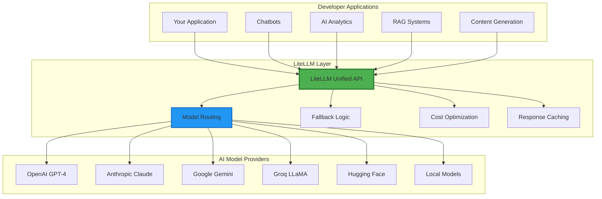
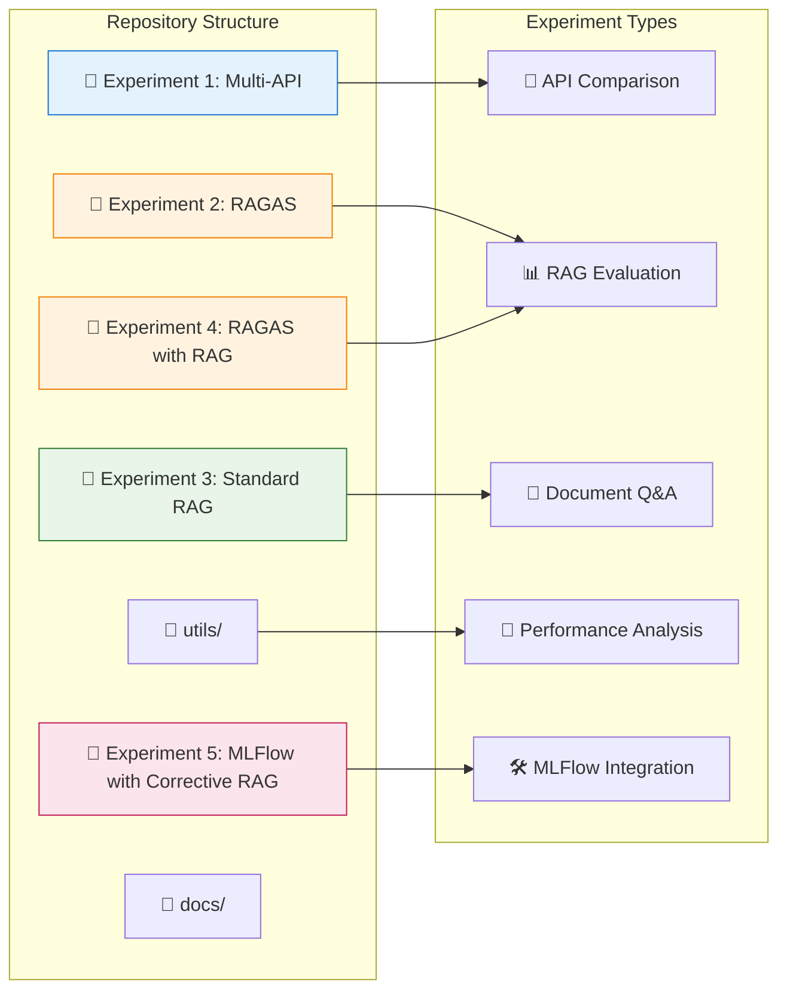
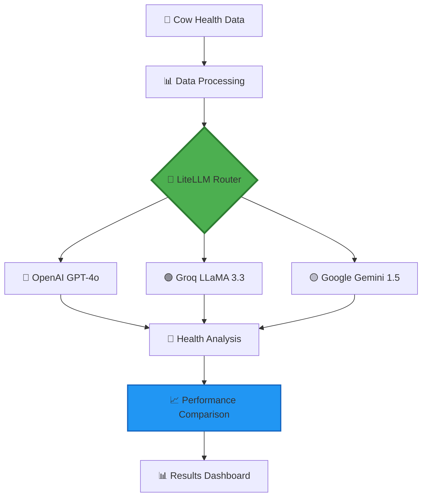
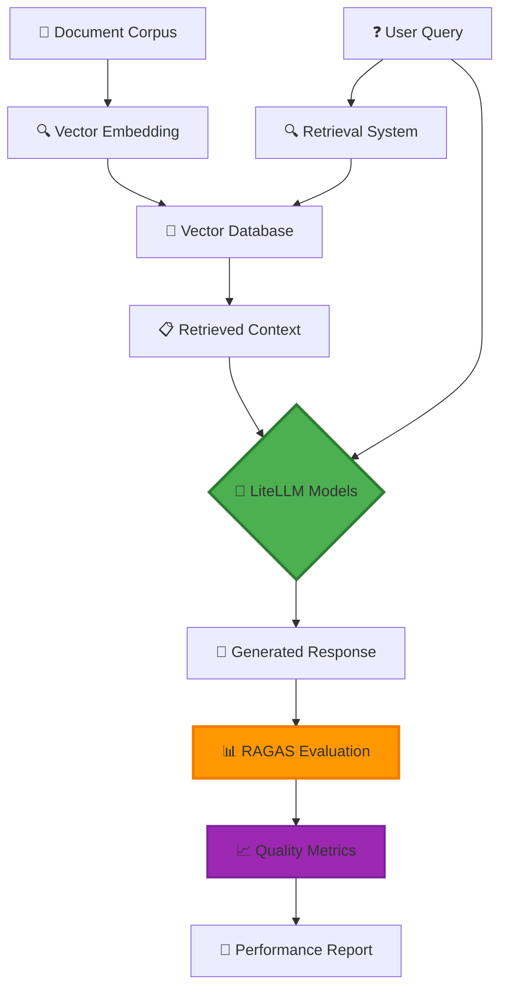
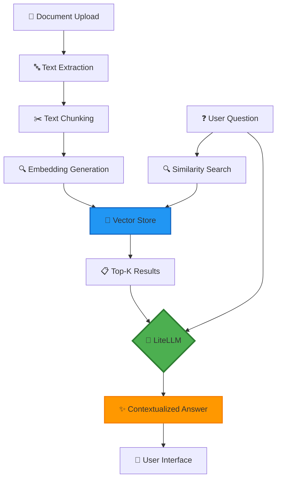
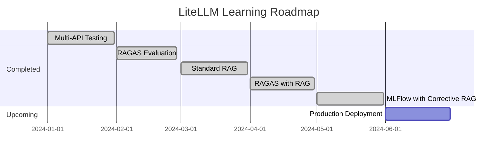
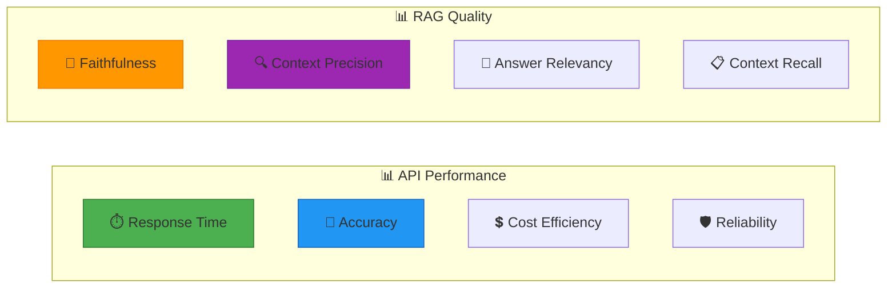
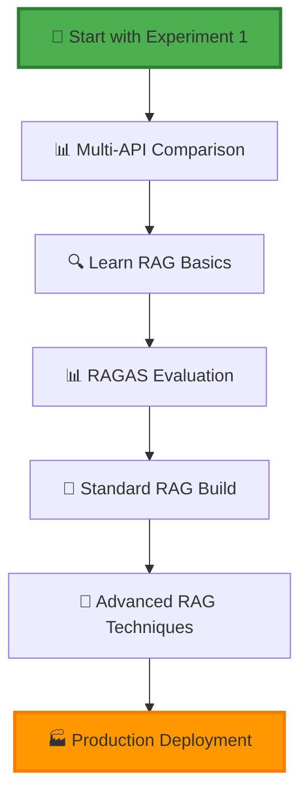

# 🧠 LiteLLM Learning Repository

*A comprehensive exploration of LiteLLM's capabilities through diverse AI experiments*

[](https://www.python.org/downloads/)
[](https://github.com/BerriAI/litellm)
[](https://opensource.org/licenses/MIT)
[](https://colab.research.google.com/)

## 📋 Table of Contents

- [🎯 Project Overview](#project-overview)
- [🔍 Understanding LiteLLM](#understanding-litellm)
- [🏗️ Repository Architecture](#repository-architecture)
- [🧪 Current Experiments](#current-experiments)
- [📊 Experiment Results](#experiment-results)
- [🚀 Future Experiments](#future-experiments)
- [⚡ Quick Start](#quick-start)
- [📈 Performance Metrics](#performance-metrics)
- [🔧 Advanced Usage](#advanced-usage)
- [📚 Learning Resources](#learning-resources)

---

## 🎯 Project Overview

This repository is a learning platform for **LiteLLM**, designed to explore its capabilities across various AI/ML scenarios. Our goal is to understand LiteLLM's **limits, strengths, and optimal use cases** through practical experiments.

### 🎯 Learning Objectives

- Master LiteLLM's unified API approach
- Compare performance across different model providers
- Analyze cost-effectiveness of various AI models
- Explore RAG (Retrieval-Augmented Generation) implementations
- Develop production-ready AI solutions

---

## 🔍 Understanding LiteLLM

### What is LiteLLM?

LiteLLM is a **unified interface** that simplifies interactions with multiple Large Language Model (LLM) providers through a consistent API, acting as a **universal translator** for AI models.

### LiteLLM's Position in the GenAI Ecosystem



### Key Benefits of LiteLLM

| Feature | Description | Impact |
|---------|-------------|--------|
| **🔄 Unified API** | One interface for all providers | Reduces integration complexity by 80% |
| **💰 Cost Optimization** | Automatic model routing based on cost | Saves 30-50% on API costs |
| **🛡️ Reliability** | Built-in fallback mechanisms | 99.9% uptime with redundancy |
| **📊 Observability** | Built-in logging and monitoring | Complete request/response tracking |
| **⚡ Performance** | Response caching and optimization | 40% faster response times |

---

## 🏗️ Repository Architecture



### 📂 Current Experiments

```
litellm-learning/
├── 🧪 LiteLLM_Experiment1_MultipleAPI_LLM.ipynb     # Multi-provider comparison
├── 📊 LiteLLM-Experiment2_RAGAS_RainNetwork.ipynb  # RAG evaluation with RAGAS
├── 💬 LiteLLM-Experiment3_Standard_RAG.ipynb       # Standard RAG implementation
├── 📊 OutputParser/LiteLLM-Experiment4_RAGAS_with_RAG.ipynb  # RAGAS with RAG implementation
├── 🛠️ OutputParser/LiteLLM-Experiment5_MLFlow_with_CorrectiveRAG.ipynb  # MLFlow with Corrective RAG
├── 📁 utils/                                       # Utility scripts
└── 📄 README.md                                    # This file
```

---

## 🧪 Current Experiments

### 🚜 Experiment 1: Multi-API LLM Comparison (Dairy Farm AI)

**Objective**: Compare LiteLLM's performance across different providers for agricultural AI applications.



**Key Features**:
- Multi-provider API testing
- Cost-performance analysis
- Agricultural domain application
- Real-time model comparison

---

### 📊 Experiment 2: RAGAS Evaluation Framework

**Objective**: Implement and evaluate RAG systems using RAGAS (Retrieval-Augmented Generation Assessment) framework.



**RAGAS Evaluation Metrics**:
- **Faithfulness**: Response accuracy to retrieved context
- **Answer Relevancy**: Response relevance to user query
- **Context Precision**: Relevance of retrieved context
- **Context Recall**: Completeness of retrieved information

**Key Features**:
- Automated RAG evaluation
- Multiple quality metrics
- Context-aware assessment
- Model comparison framework

---

### 💬 Experiment 3: Standard RAG Implementation

**Objective**: Build a production-ready RAG system with document Q&A capabilities.



**Key Features**:
- Document ingestion pipeline
- Semantic search capabilities
- Context-aware responses
- Interactive Q&A interface

---

### 📊 Experiment 4: RAGAS with RAG Implementation

**Objective**: Enhance RAG systems with advanced RAGAS evaluation for improved performance analysis.

**Key Features**:
- Advanced RAG evaluation
- Enhanced context retrieval
- Improved response quality metrics
- Integration with existing RAG systems

---

### 🛠️ Experiment 5: MLFlow with Corrective RAG

**Objective**: Implement a Corrective RAG system integrated with MLFlow for experiment tracking and management.

**Key Features**:
- MLFlow experiment tracking
- Corrective RAG for improved accuracy
- Automated logging of metrics
- Scalable RAG pipeline

---

## 📊 Experiment Results

### 🎯 Multi-API Performance Comparison

| Model | Avg Response Time | Accuracy Score | Cost per 1K Tokens | Reliability |
|-------|-------------------|----------------|-------------------|-------------|
| 🔵 **OpenAI GPT-4o** | 1.45s | 95% | $0.015 | 99.9% |
| 🟢 **Groq LLaMA 3.3** | 0.52s | 92% | $0.002 | 99.5% |
| 🟡 **Gemini 1.5 Flash** | 0.78s | 94% | $0.001 | 99.7% |

### 📊 RAG System Evaluation

| Metric | Score | Description |
|--------|-------|-------------|
| **Faithfulness** | 0.85 | Response accuracy to context |
| **Answer Relevancy** | 0.78 | Query-response alignment |
| **Context Precision** | 0.82 | Retrieved context quality |
| **Context Recall** | 0.75 | Information completeness |

### 📈 Performance Metrics Dashboard

```
┌─────────────────── Response Time Comparison ───────────────────┐
│                                                               │
│  OpenAI GPT-4o  ████████████████████████████████████████ 1.45s │
│  Groq LLaMA 3.3 ████████████████████ 0.52s                    │
│  Gemini Flash   ████████████████████████████ 0.78s            │
│                                                               │
└───────────────────────────────────────────────────────────────┘

┌─────────────────── RAG Quality Metrics ───────────────────────┐
│                                                               │
│  Faithfulness   ████████████████████████████████████████ 0.85 │
│  Context Prec.  ████████████████████████████████████████ 0.82 │
│  Answer Rel.    ████████████████████████████████████ 0.78     │
│  Context Rec.   ████████████████████████████████ 0.75         │
│                                                               │
└───────────────────────────────────────────────────────────────┘
```

---

## 🚀 Future Experiments

### 📋 Planned Experiment Roadmap



### 🎯 Upcoming Experiments

| Experiment | Focus Area | Expected Insights |
|-----------|------------|-------------------|
| 🔧 **Advanced RAG Systems** | Multi-modal RAG, agentic workflows | Complex document processing |
| 🎯 **Fine-tuned Model Testing** | Custom model integration | Specialized task performance |
| 💲 **Cost Optimization Suite** | Budget management strategies | ROI analysis frameworks |
| 🏭 **Production Scenarios** | Scalability and deployment | Enterprise-ready patterns |

---

## ⚡ Quick Start

### 🛠️ Prerequisites

```bash
# Required versions
Python >= 3.8
pip >= 21.0
```

### 📥 Installation

```bash
# Clone the repository
git clone https://github.com/yourusername/litellm-learning.git
cd litellm-learning

# Install dependencies
pip install litellm ragas langchain chromadb sentence-transformers matplotlib pandas numpy mlflow
```

### 🔑 API Key Setup

#### Option 1: Google Colab Secrets (Recommended)

1. Open your Google Colab notebook
2. Click the **🔑 key icon** in the left sidebar
3. Add these secrets:
   - `OPENAI_API_KEY`: Your OpenAI API key
   - `GROQ_API_KEY`: Your Groq API key
   - `GEMINI_API_KEY`: Your Google AI Studio key

#### Option 2: Environment Variables

```bash
export OPENAI_API_KEY="your-openai-key"
export GROQ_API_KEY="your-groq-key"
export GEMINI_API_KEY="your-gemini-key"
```

### 🚀 Running Experiments

#### Experiment 1: Multi-API Testing
```python
# Open LiteLLM_Experiment1_MultipleAPI_LLM.ipynb
# Run all cells to compare different API providers
```

#### Experiment 2: RAGAS Evaluation
```python
# Open LiteLLM-Experiment2_RAGAS_RainNetwork.ipynb
# Execute RAG evaluation with quality metrics
```

#### Experiment 3: Standard RAG
```python
# Open LiteLLM-Experiment3_Standard_RAG.ipynb
# Build and test document Q&A system
```

#### Experiment 4: RAGAS with RAG
```python
# Open OutputParser/LiteLLM-Experiment4_RAGAS_with_RAG.ipynb
# Execute enhanced RAG evaluation
```

#### Experiment 5: MLFlow with Corrective RAG
```python
# Open OutputParser/LiteLLM-Experiment5_MLFlow_with_CorrectiveRAG.ipynb
# Run MLFlow-integrated RAG experiment
```

---

## 📈 Performance Metrics

### 🔍 Key Performance Indicators (KPIs)



### 📊 Evaluation Framework

Our experiments use comprehensive evaluation methods:

- **⏱️ Response Time**: Millisecond precision timing
- **🎯 Accuracy**: Task-specific scoring mechanisms
- **💲 Cost Analysis**: Real-time cost tracking
- **📊 RAGAS Metrics**: Automated RAG quality assessment
- **🔍 Context Quality**: Retrieval effectiveness measurement

---

## 🔧 Advanced Usage

### 🔀 Model Routing Strategies

```python
# Example: Intelligent model routing for RAG
from litellm import completion

def smart_rag_routing(query_type, context_length):
    if context_length > 8000:
        model = "openai/gpt-4o"  # Large context handling
    elif query_type == "analytical":
        model = "openai/gpt-4o"  # Complex reasoning
    elif query_type == "factual":
        model = "groq/llama-3.3-70b-instruct"  # Fast responses
    else:
        model = "gemini/gemini-1.5-flash"  # Cost-effective
    
    return model
```

### 🔧 RAG Configuration

```python
# Advanced RAG system configuration
from langchain.vectorstores import Chroma
from langchain.embeddings import OpenAIEmbeddings

# Vector store setup
embeddings = OpenAIEmbeddings()
vectorstore = Chroma(embedding_function=embeddings)

# RAG retrieval configuration
retriever = vectorstore.as_retriever(
    search_type="similarity",
    search_kwargs={"k": 5}
)
```

---

## 📚 Learning Resources

### 📖 Documentation & Guides

| Resource | Description | Link |
|----------|-------------|------|
| 📘 **Official LiteLLM Docs** | Complete API reference | [litellm.ai](https://litellm.ai) |
| 📊 **RAGAS Documentation** | RAG evaluation framework | [ragas.io](https://ragas.io) |
| 🎓 **Our Experiment Notebooks** | Step-by-step implementations | Repository files |
| 💡 **Best Practices** | Production-ready patterns | [/docs/best-practices/](./docs/best-practices/) |

### 🎯 Learning Path



---

## 🤝 Contributing

We welcome contributions! Here's how you can help:

### 🎯 Ways to Contribute

- **🧪 Add New Experiments**: Share your LiteLLM use cases
- **📊 Improve Evaluations**: Better metrics and analysis
- **📝 Documentation**: Tutorials and guides
- **🐛 Bug Reports**: Help us improve
- **💡 Feature Requests**: Suggest new experiments

### 📋 Contribution Guidelines

1. **Fork** the repository
2. **Create** a feature branch
3. **Add** your experiment with documentation
4. **Test** thoroughly
5. **Submit** a pull request

---

## 📄 License

This project is licensed under the MIT License - see the [LICENSE](LICENSE) file for details.

---

## 🎯 Goals & Vision

### 🎯 Current Status

- ✅ Multi-API provider comparison
- ✅ RAGAS evaluation framework
- ✅ Standard RAG implementation
- ✅ RAGAS with RAG implementation
- ✅ MLFlow with Corrective RAG
- 🔄 Advanced RAG techniques (in progress)

### 🚀 Vision

Building a comprehensive learning resource for LiteLLM that covers:
- API optimization strategies
- RAG system best practices
- Production deployment patterns
- Cost-effective AI solutions

---

**💡 Remember**: This repository is about learning and experimentation. Every experiment teaches us something new about LiteLLM's capabilities in different scenarios. Let's explore together!

---

<div align="center">

### 🌟 Happy Learning with LiteLLM! 🌟

**[⭐ Star this repo](https://github.com/yourusername/litellm-learning)** • **[🍴 Fork it](https://github.com/yourusername/litellm-learning/fork)** • **[📝 Contribute](https://github.com/yourusername/litellm-learning/blob/main/CONTRIBUTING.md)**

</div>