# 🧠 LiteLLM Learning Repository

*A comprehensive exploration of LiteLLM's capabilities through diverse AI experiments*

[](https://www.python.org/downloads/)
[](https://github.com/BerriAI/litellm)
[](https://opensource.org/licenses/MIT)
[](https://colab.research.google.com/)

## 📋 Table of Contents

- [🎯 Project Overview](#project-overview)
- [🔍 Understanding LiteLLM](#understanding-litellm)
- [🏗️ Repository Architecture](#repository-architecture)
- [🧪 Current Experiments](#current-experiments)
- [📊 Experiment Results](#experiment-results)
- [🚀 Future Experiments](#future-experiments)
- [⚡ Quick Start](#quick-start)
- [📈 Performance Metrics](#performance-metrics)
- [🔧 Advanced Usage](#advanced-usage)
- [📚 Learning Resources](#learning-resources)

---

## 🎯 Project Overview

This repository is a learning platform for **LiteLLM**, designed to explore its capabilities across various AI/ML scenarios. Our goal is to understand LiteLLM's **limits, strengths, and optimal use cases** through practical experiments.

### 🎯 Learning Objectives

- Master LiteLLM's unified API approach
- Compare performance across different model providers
- Analyze cost-effectiveness of various AI models
- Explore real-world applications and use cases
- Develop production-ready AI solutions

---

## 🔍 Understanding LiteLLM

### What is LiteLLM?

LiteLLM is a **unified interface** that simplifies interactions with multiple Large Language Model (LLM) providers through a consistent API, acting as a **universal translator** for AI models.

### LiteLLM's Position in the GenAI Ecosystem


### Key Benefits of LiteLLM

| Feature | Description | Impact |
|---------|-------------|--------|
| **🔄 Unified API** | One interface for all providers | Reduces integration complexity by 80% |
| **💰 Cost Optimization** | Automatic model routing based on cost | Saves 30-50% on API costs |
| **🛡️ Reliability** | Built-in fallback mechanisms | 99.9% uptime with redundancy |
| **📊 Observability** | Built-in logging and monitoring | Complete request/response tracking |
| **⚡ Performance** | Response caching and optimization | 40% faster response times |

---

## 🏗️ Repository Architecture

```mermaid
graph LR
    subgraph "Repository Structure"
        A[📁 experiments/]
        B[📁 dairy-farm-ai/]
        C[📁 huggingface-experiments/]
        D[📁 fine-tuned-models/]
        E[📁 cost-analysis/]
        F[📁 performance-benchmarks/]
        G[📁 production-examples/]
        H[📁 utils/]
        I[📁 docs/]
    end
    
    subgraph "Experiment Categories"
        J[🔬 API-based Models]
        K[🤗 Local HF Models]
        L[🎯 Fine-tuned Models]
        M[💲 Cost Optimization]
        N[⚡ Performance Testing]
        O[🏭 Production Scenarios]
    end
    
    A --> J
    B --> J
    C --> K
    D --> L
    E --> M
    F --> N
    G --> O
    
    style A fill:#E3F2FD,stroke:#1976D2
    style J fill:#FFF3E0,stroke:#F57C00
```



### 📂 Directory Structure

```
litellm-learning/
├── 📁 experiments/
│   ├── 🧪 dairy-farm-ai/          # Current: Agricultural AI
│   ├── 🤗 huggingface-local/      # Coming: Local model testing
│   ├── 🎯 fine-tuned-models/      # Coming: Custom model experiments
│   ├── 💲 cost-optimization/      # Coming: Cost analysis
│   └── ⚡ performance-benchmarks/ # Coming: Speed & accuracy tests
├── 📁 utils/
│   ├── model_comparison.py        # Model comparison utilities
│   ├── cost_calculator.py         # Cost analysis tools
│   └── performance_tracker.py     # Performance monitoring
├── 📁 docs/
│   ├── setup-guides/              # Setup instructions
│   ├── tutorials/                 # Step-by-step guides
│   └── best-practices/            # LiteLLM best practices
└── 📄 README.md                   # This file
```

---

## 🧪 Current Experiments

### 🚜 Experiment 1: Dairy Farm AI Health Predictor

**Objective**: Compare LiteLLM's performance across different providers for agricultural AI applications.

#### 🔄 Experiment Workflow

```mermaid
flowchart TD
    A[🐄 Cow Sensor Data] --> B[📊 Data Preprocessing]
    B --> C{🤖 LiteLLM Router}
    
    C --> D[🔵 OpenAI GPT-4o]
    C --> E[🟢 Groq LLaMA 3.3]
    C --> F[🟡 Google Gemini 1.5]
    
    D --> G[🏥 Health Diagnosis]
    E --> G
    F --> G
    
    D --> H[🥛 Milk Yield Prediction]
    E --> H
    F --> H
    
    G --> I[📈 Performance Analysis]
    H --> I
    
    I --> J[📊 Results Visualization]
    J --> K[🎯 Model Recommendation]
    
    style C fill:#4CAF50,stroke:#2E7D32,stroke-width:3px
    style I fill:#2196F3,stroke:#1565C0,stroke-width:2px
    style K fill:#FF9800,stroke:#F57C00,stroke-width:2px
```



#### 🔧 System Architecture


#### 📊 Data Flow

```mermaid
sequenceDiagram
    participant App as 🖥️ Application
    participant LLM as 🤖 LiteLLM
    participant OAI as 🔵 OpenAI
    participant GRQ as 🟢 Groq
    participant GEM as 🟡 Gemini
    
    App->>LLM: Send cow data for analysis
    
    par Parallel API Calls
        LLM->>OAI: Health diagnosis request
        LLM->>GRQ: Health diagnosis request
        LLM->>GEM: Health diagnosis request
    end
    
    OAI-->>LLM: Health diagnosis response
    GRQ-->>LLM: Health diagnosis response
    GEM-->>LLM: Health diagnosis response
    
    par Parallel API Calls
        LLM->>OAI: Milk yield prediction request
        LLM->>GRQ: Milk yield prediction request
        LLM->>GEM: Milk yield prediction request
    end
    
    OAI-->>LLM: Milk yield prediction response
    GRQ-->>LLM: Milk yield prediction response
    GEM-->>LLM: Milk yield prediction response
    
    LLM->>App: Compiled results with performance metrics
```



---

## 📊 Experiment Results

### 🎯 Performance Comparison

| Model | Avg Response Time | Accuracy Score | Cost per 1K Tokens | Reliability |
|-------|-------------------|----------------|-------------------|-------------|
| 🔵 **OpenAI GPT-4o** | 1.45s | 95% | $0.015 | 99.9% |
| 🟢 **Groq LLaMA 3.3** | 0.52s | 92% | $0.002 | 99.5% |
| 🟡 **Gemini 1.5 Flash** | 0.78s | 94% | $0.001 | 99.7% |

### 📈 Performance Metrics Dashboard

```
┌─────────────────── Response Time Comparison ───────────────────┐
│                                                               │
│  OpenAI GPT-4o  ████████████████████████████████████████ 1.45s │
│  Groq LLaMA 3.3 ████████████████████ 0.52s                    │
│  Gemini Flash   ████████████████████████████ 0.78s            │
│                                                               │
└───────────────────────────────────────────────────────────────┘

┌─────────────────── Cost Efficiency Analysis ───────────────────┐
│                                                               │
│  Gemini Flash   ████████████████████████████████████████ $0.001 │
│  Groq LLaMA 3.3 ████████████████████ $0.002                   │
│  OpenAI GPT-4o  ████ $0.015                                   │
│                                                               │
└───────────────────────────────────────────────────────────────┘
```

---

## 🚀 Future Experiments

### 📋 Planned Experiment Roadmap


### 🎯 Upcoming Experiments

| Experiment | Focus Area | Expected Insights |
|-----------|------------|-------------------|
| 🤗 **HuggingFace Local Models** | Local deployment efficiency | Cost vs performance trade-offs |
| 🎯 **Fine-tuned Model Testing** | Custom model integration | Specialized task performance |
| 💲 **Cost Optimization Suite** | Budget management | Optimal model selection strategies |
| ⚡ **Performance Benchmarking** | Speed and accuracy | Real-world performance metrics |
| 🏭 **Production Scenarios** | Scalability testing | Enterprise deployment patterns |

---

## ⚡ Quick Start

### 🛠️ Prerequisites

```bash
# Required versions
Python >= 3.8
pip >= 21.0
```

### 📥 Installation

```bash
# Clone the repository
git clone https://github.com/yourusername/litellm-learning.git
cd litellm-learning

# Install dependencies
pip install -r requirements.txt

# Or install specific packages
pip install litellm matplotlib pandas numpy
```

### 🔑 API Key Setup

#### Option 1: Google Colab Secrets (Recommended)

1. Open your Google Colab notebook
2. Click the **🔑 key icon** in the left sidebar
3. Add these secrets:
   - `OPENAI_API_KEY`: Your OpenAI API key
   - `GROQ_API_KEY`: Your Groq API key
   - `GEMINI_API_KEY`: Your Google AI Studio key

#### Option 2: Environment Variables

```bash
export OPENAI_API_KEY="your-openai-key"
export GROQ_API_KEY="your-groq-key"
export GEMINI_API_KEY="your-gemini-key"
```

#### Option 3: `.env` File

```env
OPENAI_API_KEY=your-openai-key
GROQ_API_KEY=your-groq-key
GEMINI_API_KEY=your-gemini-key
```

### 🚀 Running Your First Experiment

```python
# Import the experiment
from experiments.dairy_farm_ai import DairyFarmPredictor

# Initialize the predictor
predictor = DairyFarmPredictor()

# Run the experiment
results = predictor.run_experiment()

# View results
predictor.display_results(results)
```

### 📊 Google Colab Quick Start

[](https://colab.research.google.com/github/yourusername/litellm-learning/blob/main/experiments/dairy_farm_ai/dairy_farm_colab.ipynb)

Click the badge above to open the dairy farm experiment directly in Google Colab!

---

## 📈 Performance Metrics

### 🔍 Key Performance Indicators (KPIs)

```mermaid
graph LR
    subgraph "📊 Performance Metrics"
        A[⏱️ Response Time]
        B[🎯 Accuracy]
        C[💲 Cost Efficiency]
        D[🛡️ Reliability]
        E[📈 Throughput]
        F[🔄 Consistency]
    end
    
    subgraph "📋 Measurement Tools"
        G[Built-in Timers]
        H[Accuracy Scoring]
        I[Cost Calculators]
        J[Error Tracking]
        K[Load Testing]
        L[Response Analysis]
    end
    
    A --> G
    B --> H
    C --> I
    D --> J
    E --> K
    F --> L
    
    style A fill:#4CAF50,stroke:#2E7D32
    style B fill:#2196F3,stroke:#1565C0
    style C fill:#FF9800,stroke:#F57C00
    style D fill:#9C27B0,stroke:#7B1FA2
```



### 📊 Benchmarking Framework

Our experiments use a comprehensive benchmarking framework:

- **⏱️ Response Time**: Millisecond precision timing
- **🎯 Accuracy**: Task-specific scoring mechanisms
- **💲 Cost Analysis**: Real-time cost tracking
- **🛡️ Error Handling**: Comprehensive error logging
- **📈 Scalability**: Load testing capabilities

---

## 🔧 Advanced Usage

### 🔀 Model Routing Strategies

```python
# Example: Intelligent model routing
from litellm import completion

def smart_routing(prompt, task_type="general"):
    if task_type == "speed_critical":
        model = "groq/llama-3.3-70b-instruct"
    elif task_type == "accuracy_critical":
        model = "openai/gpt-4o"
    elif task_type == "cost_sensitive":
        model = "gemini/gemini-1.5-flash"
    else:
        model = "openai/gpt-4o"  # Default
    
    return completion(
        model=model,
        messages=[{"role": "user", "content": prompt}],
        fallbacks=["groq/llama-3.3-70b-instruct", "gemini/gemini-1.5-flash"]
    )
```

### 🔧 Custom Configuration

```python
# Advanced LiteLLM configuration
import litellm

# Set custom timeouts
litellm.request_timeout = 30

# Enable caching
litellm.cache = True

# Set fallback models
litellm.fallbacks = [
    "groq/llama-3.3-70b-instruct",
    "gemini/gemini-1.5-flash"
]

# Custom retry logic
litellm.num_retries = 3
```

---

## 📚 Learning Resources

### 📖 Documentation & Guides

| Resource | Description | Link |
|----------|-------------|------|
| 📘 **Official LiteLLM Docs** | Complete API reference | [litellm.ai](https://litellm.ai) |
| 🎓 **Our Tutorial Series** | Step-by-step learning guides | [/docs/tutorials/](./docs/tutorials/) |
| 💡 **Best Practices** | Production-ready patterns | [/docs/best-practices/](./docs/best-practices/) |
| 🔧 **Setup Guides** | Environment configuration | [/docs/setup-guides/](./docs/setup-guides/) |

### 🤝 Community & Support

- **GitHub Issues**: Report bugs and request features
- **Discussions**: Share insights and ask questions
- **Discord**: Real-time community chat
- **Blog**: Latest updates and case studies

### 🎯 Learning Path

```mermaid
graph TD
    A[🌟 Start Here] --> B[📚 Read Documentation]
    B --> C[🧪 Run First Experiment]
    C --> D[🔍 Understand Results]
    D --> E[⚡ Optimize Performance]
    E --> F[💲 Analyze Costs]
    F --> G[🏭 Plan Production]
    G --> H[🚀 Deploy Solution]
    
    style A fill:#4CAF50,stroke:#2E7D32,stroke-width:3px
    style H fill:#FF9800,stroke:#F57C00,stroke-width:3px
```



---

## 🤝 Contributing

We welcome contributions! Here's how you can help:

### 🎯 Ways to Contribute

- **🧪 Add New Experiments**: Share your LiteLLM use cases
- **📊 Improve Visualizations**: Better charts and graphs
- **📝 Documentation**: Tutorials and guides
- **🐛 Bug Reports**: Help us improve
- **💡 Feature Requests**: Suggest new experiments

### 📋 Contribution Guidelines

1. **Fork** the repository
2. **Create** a feature branch
3. **Add** your experiment with documentation
4. **Test** thoroughly
5. **Submit** a pull request

---

## 📄 License

This project is licensed under the MIT License - see the [LICENSE](LICENSE) file for details.

---

## 🌟 Star History

[](https://star-history.com/#yourusername/litellm-learning&Date)

---

## 🎯 Goals & Vision

### 🎯 Short-term Goals (Q1-Q2 2024)

- ✅ Complete dairy farm AI experiment
- 🔄 Implement cost analysis framework
- 📊 Add performance benchmarking suite
- 🤗 Integrate HuggingFace local models

### 🚀 Long-term Vision (2024-2025)

- 🏭 Production-ready deployment patterns
- 🎯 Custom model fine-tuning experiments
- 📈 Comprehensive performance database
- 🌍 Community-driven experiment library

---

**💡 Remember**: This repository is about learning and experimentation. Every experiment teaches us something new about LiteLLM's capabilities and limitations. Let's explore together!

---

<div align="center">

### 🌟 Happy Learning with LiteLLM! 🌟

**[⭐ Star this repo](https://github.com/yourusername/litellm-learning)** • **[🍴 Fork it](https://github.com/yourusername/litellm-learning/fork)** • **[📝 Contribute](https://github.com/yourusername/litellm-learning/blob/main/CONTRIBUTING.md)**

</div>